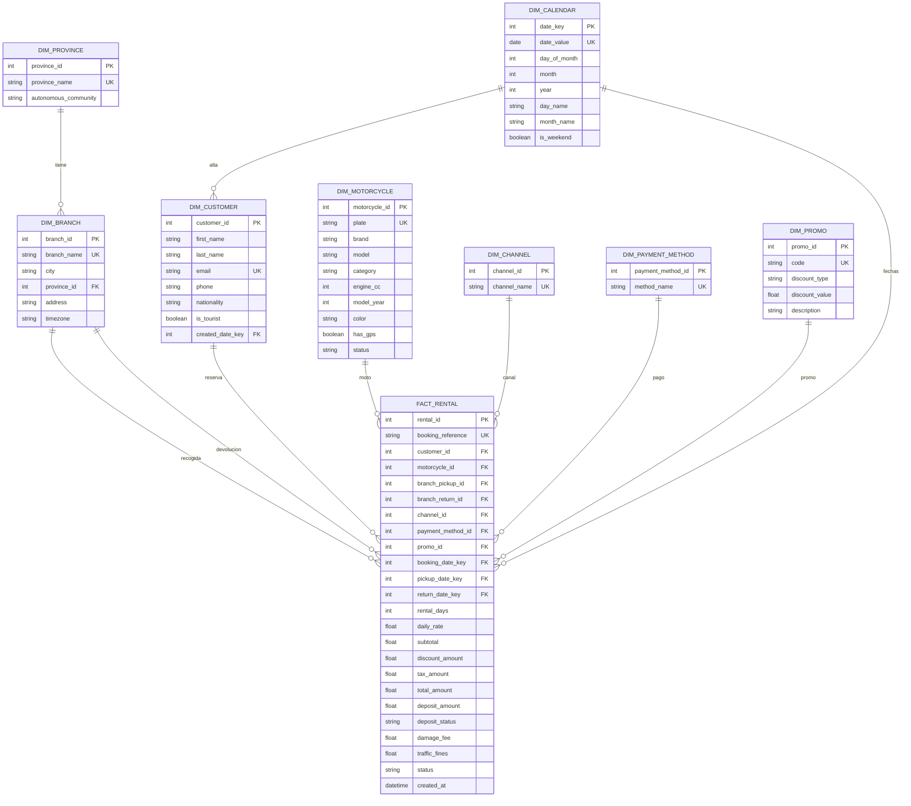

# Modelo de Datos (ERD)

## Qué modela este ERD?

- **Hechos**: `fact_rental` (1 fila = 1 reserva de 1 moto).
- **Dimensiones**: `dim_*` (cliente, moto, sucursal, provincia, calendario, canal, pago, promo).

En la práctica, el análisis se centra en métricas de `fact_rental` y se cruza con dimensiones para responder “quién / qué / dónde / cuándo / cómo”.

## ERD (Mermaid)

## Decisiones de diseño

- **`date_key` (YYYYMMDD)**: simplifica uniones/ordenación temporal. Cuando necesito fecha uso `TO_DATE(date_key::text, 'YYYYMMDD')`.
- **Promo opcional**: `promo_id` puede ser `NULL` (no todas las reservas usan código).
- **Integridad**: `CHECK` para catálogos (estados), `UNIQUE` para claves naturales (email, matrícula, etc.).
- **Vistas** (en `sql/01_schema.sql`):
  - `vw_rental_enriched`: fact + dimensiones + campos derivados para análisis.
  - `vw_rental_summary`: resumen provincia × mes para decisiones.

